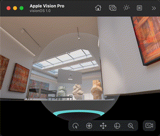
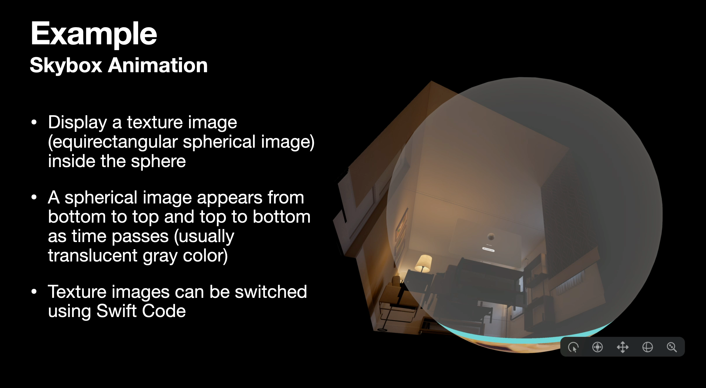
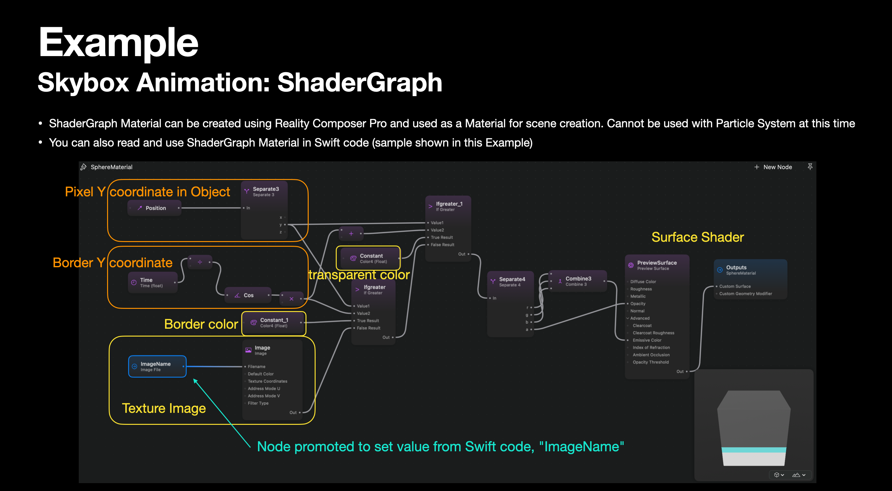
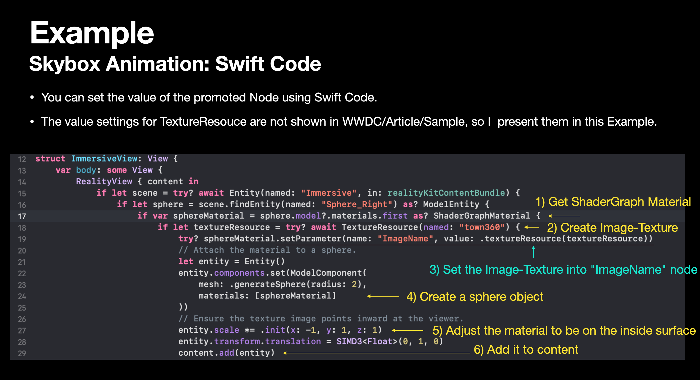

# 360 Viewer in visionOS

A very simple AR app in visionOS, that shows a 360 sphere image using the new ShaderGraph Material.

- Build: Xcode 15.2 beta
- Target: visionOS 1.0 beta (You can run this app with the Vision Pro simulator of Xcode 15)

*Since this project is based on the beta software, this repository is temporal.*

This project shows some features of RealityKit in visionOS;

- ShaderGraph Material
- Parameter modification of ShaderGraph with Swift code

## References

- Article related to this project: TBD

## License

